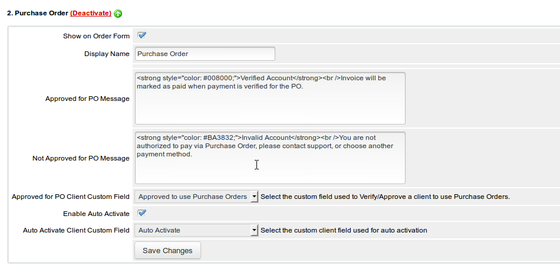
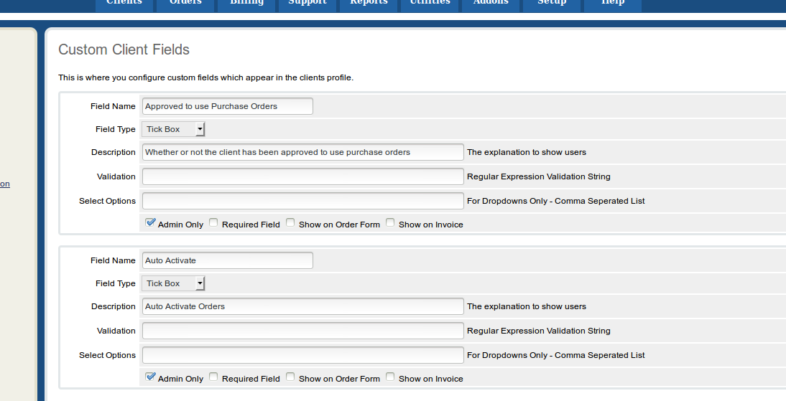
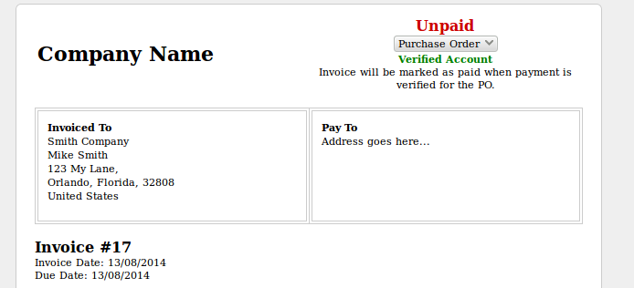

WHMCS Purchase Order Gateway
===================

This is an open source gateway file for WHMCS.  This module will allow you to add an option to your checkout page with "Purchase Order" as an option.  

This also includes an auto activation option as well.  By using a custom client checkbox field you can configure WHMCS to automatically approve/activate orders if the client has the checkbox enabled under their profile.

### Installation
---
Copy the `purchaseorder.php` file to your WHMCS installation under `/modules/gateways/purchaseorder.php`, then go to WHMCS admin and enable Purchase Order as a Gateway.

### Initial Setup
---
To set everything up you will need to create at least 2 custom client fields.  One checkbox (also called tickbox) for **Approved to use Purchase Orders** and another checkbox (tickbox) field for **Auto Order Activation**.

Once you have created those fields go back to the **Gateway Configuration** and select the fields you created from the dropdown menu under the Purchase Order configuration.

Profit!

### Planned Features
---

Feature | Description
--- | ---
Client Group | Ability to auto activate based on client groups, if user is in client group auto activate.
Enter PO # | Ability to enter a Purchase Order number at the end of checking out which will be tied to the order.
Credit Limit | Set a specific credit limit for a client, once they reach that limit they can no longer auto activate
Available Credit | Field that shows the available credit left for the client

Got an idea?  Add an issue here on GitHub!


### Screenshots
---


Description | Screenshot
--- | ---
Purchase Order Gateway Configuration | 
Client Custom Fields | 
Client Profile Custom Fields | 
Invoice Page Output | 

For reference here's a `var_dump` of the $param values:

### `$params` values

A general layout of the $params array is like the array below.


```
Array
(
    [companyname] => My Company
    [systemurl] => https://yourhostingcompany.com
    [langpaynow] => Pay Now
    [convertto] => 
    [instructions] => 
    [name] => Purchase Order
    [type] => Invoices
    [visible] => on
    [paymentmethod] => purchaseorder
    [invoiceid] => 111111
    [invoicenum] => 111111
    [amount] => 10.00
    [description] => My Company - Invoice #111111
    [returnurl] => https://yourhostingcompany.com/viewinvoice.php?id=111111
    [clientdetails] => Array
        (
            [userid] => 1
            [id] => 1
            [firstname] => Myles
            [lastname] => McNamara
            [fullname] => Myles McNamara
            [companyname] => 
            [email] => name@domain.com
            [address1] => 123 My Way
            [address2] => 
            [city] => Orlando
            [fullstate] => Florida
            [state] => FL
            [postcode] => 32808
            [countrycode] => US
            [country] => US
            [statecode] => FL
            [countryname] => United States
            [phonecc] => 1
            [phonenumber] => 4072224444
            [phonenumberformatted] => +1.4072224444
            [billingcid] => 13
            [notes] => 
            [password] => 
            [twofaenabled] => 
            [currency] => 1
            [defaultgateway] => purchaseorder
            [cctype] => 
            [cclastfour] => 
            [securityqid] => 0
            [securityqans] => 
            [groupid] => 1
            [status] => Active
            [credit] => 4.17
            [taxexempt] => on
            [latefeeoveride] => on
            [overideduenotices] => on
            [separateinvoices] => 
            [disableautocc] => on
            [emailoptout] => 0
            [overrideautoclose] => 0
            [language] => 
            [lastlogin] => Date: 08/05/2014 16:39&lt;br&gt;IP Address: 2.2.2.2&lt;br&gt;Host: 2.2.2.2.res.bhn.net
            [customfields1] => 12344
            [customfields] => Array
                (
                    [0] => Array
                        (
                            [id] => 1
                            [value] => 12344
                        )

                    [1] => Array
                        (
                            [id] => 36
                            [value] => name@domain.com
                        )

                    [2] => Array
                        (
                            [id] => 37
                            [value] => anotherfield
                        )

                    [3] => Array
                        (
                            [id] => 74
                            [value] => 1234
                        )

                    [4] => Array
                        (
                            [id] => 75
                            [value] => ABC123
                        )

                    [5] => Array
                        (
                            [id] => 76
                            [value] => on
                        )

                    [6] => Array
                        (
                            [id] => 77
                            [value] => $3,000
                        )

                )

            [customfields2] => name@domain.com
            [customfields3] => anotherfield
            [customfields4] => 1234
            [customfields5] => ABC123
            [customfields6] => on
            [customfields7] => $3,000
            [domainemails] => 0
            [generalemails] => 0
            [invoiceemails] => 0
            [productemails] => 0
            [supportemails] => 0
        )

    [currency] => USD
)


```
