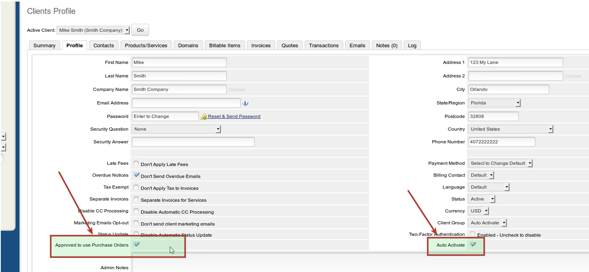

whmcs-purchaseorder
===================

Custom WHMCS Gateway to allow clients to use Purchase Orders, and Auto Activate products for specific clients based on values of Custom Client Fields.

In order to get this to work correctly you will need to add custom client fields in the backend of WHMCS.  This should be a checkbox (that you can set on admin under client profile) something like "Approved for PO" and "Auto Activate Products"

Go to Setup > Custom Client Fields from admin

Add custom field "Purchase Order #" and check show on invoice, and admin only.

This field will be under the client profile information, you can add a PO # and it will show up on the invoice automatically.  

If you want to configure some other output in the right side of the invoice area (when Purchase Order is selected from dropdown), you can do so in the configuration of the Purchase Order gateway.  There are two fields, one for approved clients and one for invalid/un-approved clients.  

There will be a dropdown for all custom client fields, select which one you want to use for the auto activate, and the approve to use Purchase Order.  These fields must be checkboxes.

### Screenshots


### `$params` values

A general layout of the $params array is like the array below.


```
Array
(
    [companyname] => My Company
    [systemurl] => https://yourhostingcompany.com
    [langpaynow] => Pay Now
    [convertto] => 
    [instructions] => 
    [name] => Purchase Order
    [type] => Invoices
    [visible] => on
    [paymentmethod] => purchaseorder
    [invoiceid] => 111111
    [invoicenum] => 111111
    [amount] => 10.00
    [description] => My Company - Invoice #111111
    [returnurl] => https://yourhostingcompany.com/viewinvoice.php?id=111111
    [clientdetails] => Array
        (
            [userid] => 1
            [id] => 1
            [firstname] => Myles
            [lastname] => McNamara
            [fullname] => Myles McNamara
            [companyname] => 
            [email] => name@domain.com
            [address1] => 123 My Way
            [address2] => 
            [city] => Orlando
            [fullstate] => Florida
            [state] => FL
            [postcode] => 32808
            [countrycode] => US
            [country] => US
            [statecode] => FL
            [countryname] => United States
            [phonecc] => 1
            [phonenumber] => 4072224444
            [phonenumberformatted] => +1.4072224444
            [billingcid] => 13
            [notes] => 
            [password] => 
            [twofaenabled] => 
            [currency] => 1
            [defaultgateway] => purchaseorder
            [cctype] => 
            [cclastfour] => 
            [securityqid] => 0
            [securityqans] => 
            [groupid] => 1
            [status] => Active
            [credit] => 4.17
            [taxexempt] => on
            [latefeeoveride] => on
            [overideduenotices] => on
            [separateinvoices] => 
            [disableautocc] => on
            [emailoptout] => 0
            [overrideautoclose] => 0
            [language] => 
            [lastlogin] => Date: 08/05/2014 16:39&lt;br&gt;IP Address: 2.2.2.2&lt;br&gt;Host: 2.2.2.2.res.bhn.net
            [customfields1] => 12344
            [customfields] => Array
                (
                    [0] => Array
                        (
                            [id] => 1
                            [value] => 12344
                        )

                    [1] => Array
                        (
                            [id] => 36
                            [value] => name@domain.com
                        )

                    [2] => Array
                        (
                            [id] => 37
                            [value] => anotherfield
                        )

                    [3] => Array
                        (
                            [id] => 74
                            [value] => 1234
                        )

                    [4] => Array
                        (
                            [id] => 75
                            [value] => ABC123
                        )

                    [5] => Array
                        (
                            [id] => 76
                            [value] => on
                        )

                    [6] => Array
                        (
                            [id] => 77
                            [value] => $3,000
                        )

                )

            [customfields2] => name@domain.com
            [customfields3] => anotherfield
            [customfields4] => 1234
            [customfields5] => ABC123
            [customfields6] => on
            [customfields7] => $3,000
            [domainemails] => 0
            [generalemails] => 0
            [invoiceemails] => 0
            [productemails] => 0
            [supportemails] => 0
        )

    [currency] => USD
)


```
